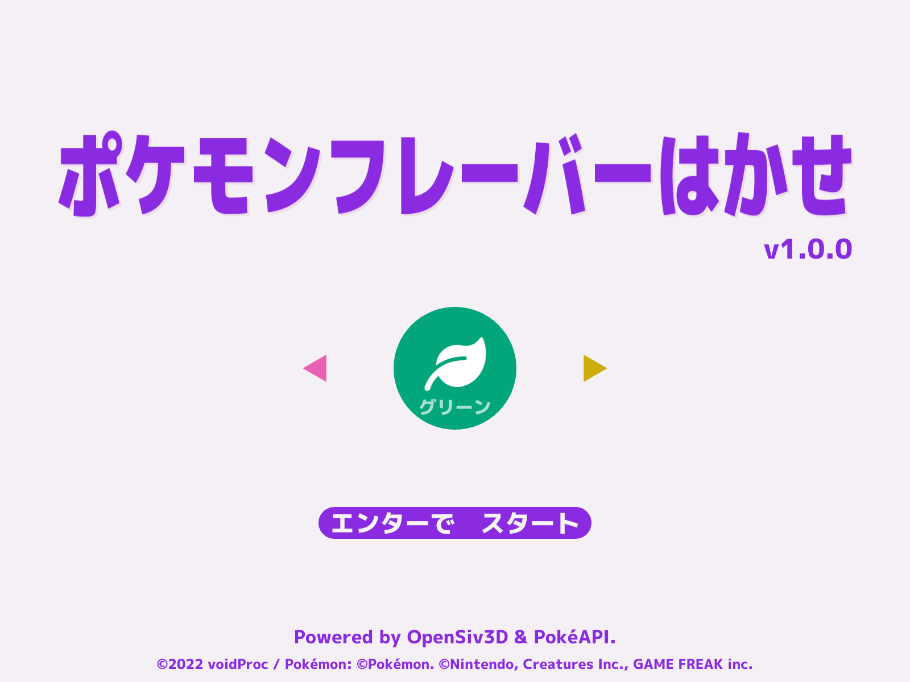
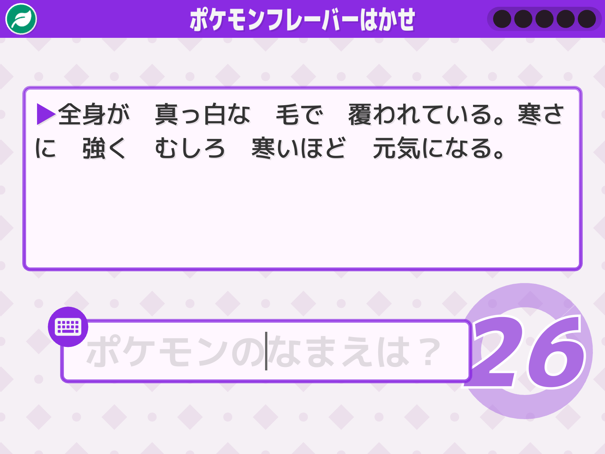
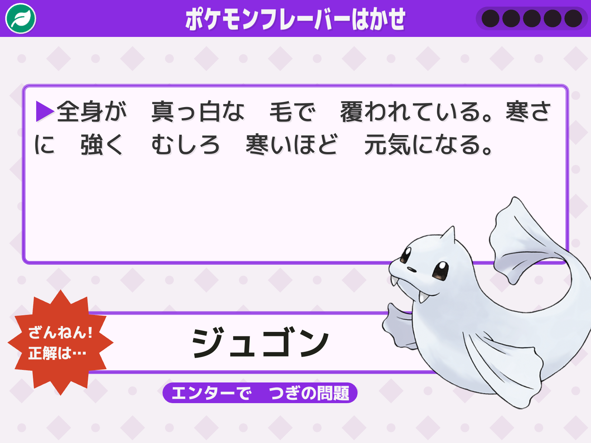
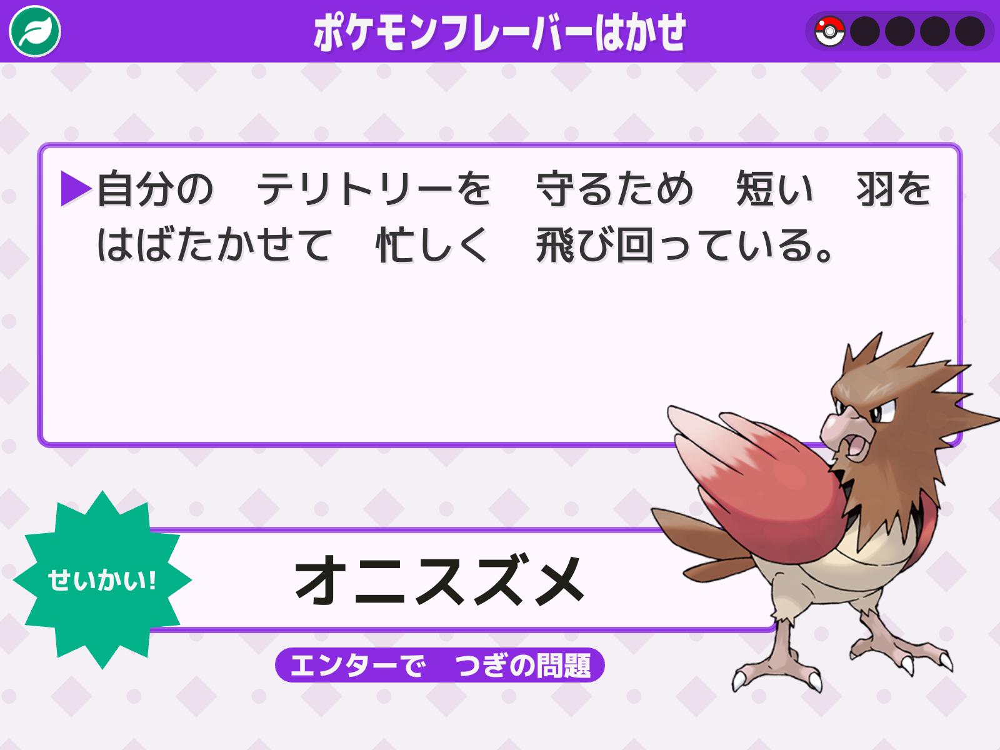

# PokemonFlavorHakase

[OpenSiv3D](https://github.com/Siv3D/OpenSiv3D) と [PokéAPI](https://pokeapi.co/) でクイズゲームを作りました。

## ダウンロード

- [Siv3D+PokéAPIでクイズゲームを作りました](https://voidproc.com/blog/archives/636)

## 開発環境

- Visual Studio 2022 Community
- [OpenSiv3D](https://github.com/Siv3D/OpenSiv3D) 0.6.6

## スクリーンショット

